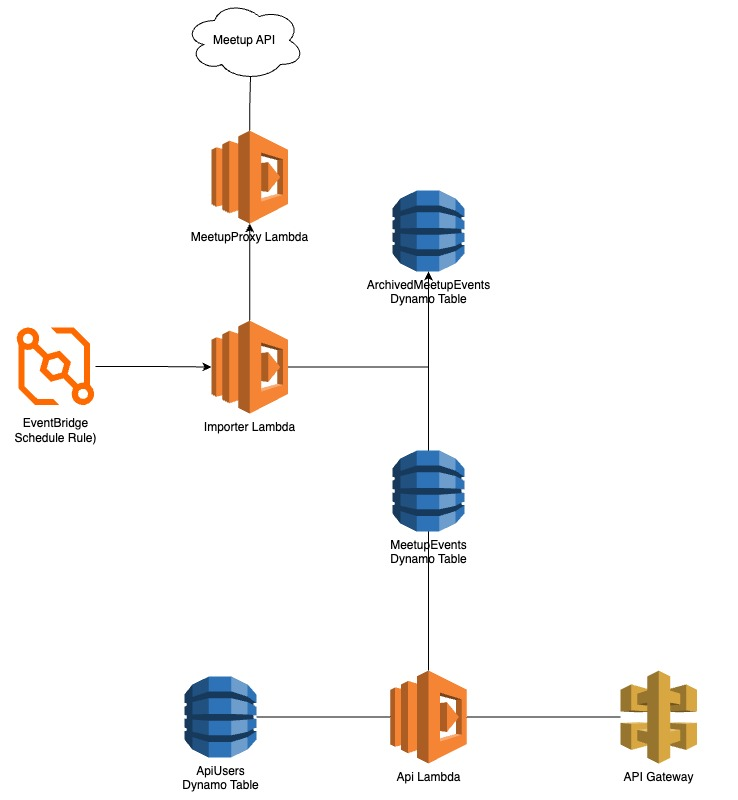

# Architecture

Architecture diagram

A primary goal of this application was for it to be hosted entirely on the AWS free tier.
This would allow the app to be used indefinitely without needing major infrastructure changes.

With that in mind the app uses the following AWS Services:
- [CDK](https://aws.amazon.com/cdk/)
  - Handles all infrastructure creation and updates
- [Lambda](https://aws.amazon.com/lambda/)
  - The main compute for the app 
- [DynamoDB](https://aws.amazon.com/dynamodb/)
  - Handles all data storage
- [EventBridge Scheduler](https://aws.amazon.com/eventbridge/scheduler/)
  - Triggers certain lambdas on a set interval
- [API Gateway](https://aws.amazon.com/api-gateway/)
  - Exposes lambdas to the public internet

Each of the lambdas is writting using [Go](https://go.dev/). TGo was picked almost entirely because one of the authors, [glitchedmob](https://github.com/glitchedmob/), was interested in learning how to use it.

The project makes signicant use of these libraries:
- [spf13/viper](https://github.com/spf13/viper)
  - Library for loading configuration from multiple sources
- [gin-gonic/gin](https://gin-gonic.com/)
  - A web framework used in the API Lambda
- [google/wire](https://github.com/google/wire)
  - A tool for generating dependency injection boilerplate
- [swaggo/swag](https://github.com/google/wire)
  - For generating OpenAPI/Swagger documentation

Of course, there are more libraries, but these are the main big ones.

The project also users this libraries in tests:
- [testcontainers/testcontainers-go](https://github.com/testcontainers/testcontainers-go)
  - Creates databases in docker containers for testing
- [stretchr/testify](https://github.com/stretchr/testify)
  - Mocking and assertion utilities
- [brianvoe/gofakeit](https://github.com/brianvoe/gofakeit)
  - Used for generating fake test data